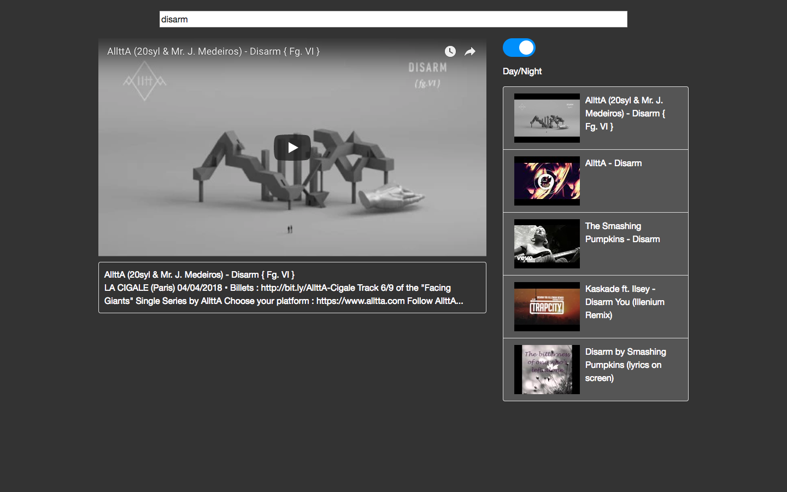

# YoutubePlayer
ReactJS app to watch youtube videos

Hey there,

This is a simple ReactJS application which can be used to watch youtube videos. It is light and stable since it has very low overhead. It requires no login/signup. It only shows videos according to your search query, no recommendations or trending videos.

## Features
 
* Requires no login/signup
* Stable and light
* Day/Night Mode
* Responsive Design
* Ability to search videos from Youtube
* Shows no recommendations or trending videos (shows videos only according to your search query)

## Screenshot

## Queries?

email me at pranavj1001@gmail.com

## License

MIT License
